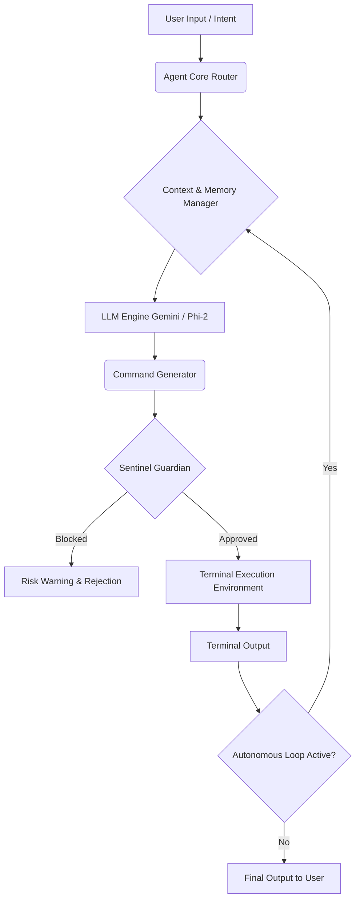

# Tele-Shell v9.2.0
### An autonomous AI agent that turns natural-language intent into terminal execution.


**Manual system administration is dead.**

Tele-Shell is an **autonomous SysOps agent** designed to navigate, repair, and secure complex environments. It translates natural language intent into verified system actions, protects you with **Sentinel 1.5**, and enables secure collaboration via **P2P Encrypted Mesh**.

---

## System Architecture

Tele-Shell leverages a ReAct (Reasoning and Acting) loop, taking natural language intent and generating verifiable terminal commands.



---

## Why Tele-Shell? (Key Features)

### 1. Full Autonomy
By appending the `--auto` flag, Tele-Shell transitions into a fully autonomous agent. It executes steps, reads terminal outputs, realizes what went wrong, fixes its own mistakes, and loops until the task is fully complete. This leverages an advanced feedback loop that allows the LLM to reflect on its execution state before taking the next step.

### 2. Adaptive Operating Modes
Tasks require different heuristic approaches. The agent's mindset can be instantly switched based on your requirements:
- **`fixer`**: Focuses exclusively on system repair and troubleshooting. It isolates the fault and repairs it sequentially.
- **`lightning`**: Optimizes the thought process for rapid command execution, reducing reasoning overhead.
- **`eco`**: Trims context overhead and preserves token limits without sacrificing core functionality.
- **`normal`**: The default balance of deep reasoning and actionable output.

### 3. Safe Execution: Undo & Sentinel 1.5
- **1-Click Rollback (`undo`)**: Tele-Shell automatically backs up any file it edits via an internal state manager. Type `undo` to restore it instantly.
- **Sentinel Risk Intelligence**: A background guardian heuristic. It evaluates generated commands against a destructive-action database and blocks hidden prompt injection attacks when reading untrusted files. Run `sentinel report` to view risk metrics.

### 4. Multi-Modal Context & Vision
- **Conversation Chain Memory**: Maintains a rolling context window of the exact input and output of the last 5 actions to make logical connections across multi-step procedures.
- **Vision Integration (Ctrl+Shift+Z)**: Allows the agent to interpret visual errors or UI states by taking an instant screenshot and passing the encoded frame to the multimodal model.

### 5. The Sleepless Watchdog (`--watch` + `--force`)
Initialize a background system monitor: `--watch if CPU usage is over 90%`. Tele-Shell will quietly monitor and alert you based on system telemetry. 
If initialized with `--force`, the agent will automatically switch to `fixer` mode and attempt to resolve the issue autonomously upon trigger.

### 6. E2E Encrypted P2P Terminal Sharing
Run `share start` via Tele-Shell's P2P network, and another node can connect via `share connect IP`. The terminals are linked with end-to-end encryption, allowing collaborative troubleshooting where remote commands are supervised and executed securely.

### 7. Ultimate Privacy: Local Mode
Run `switch offline` to download and initialize the Microsoft Phi-2 model. This runs entirely on your local machine, ensuring a 100% air-gapped privacy mode, though with reduced reasoning capabilities compared to cloud-hosted models.

---

## Quick Install

```bash
# 1. Install Dependencies
pip install google-generativeai colorama psutil posthog pyautogui keyboard requests beautifulsoup4

# 2. Set API Key
# For Windows (PowerShell):
$env:GEMINI_API_KEY="your_key_here"
# For Linux/macOS (Bash):
export GEMINI_API_KEY="your_key_here"

# 3. Run
git clone https://github.com/TaklaXBR/tele-shell.git
cd tele-shell
python teleshell.py
```
*Optional: `pip install cryptography` (P2P Encryption), `chromadb` (Long-term Memory)*

---

## Command Reference

| Category | Command | Description |
| :--- | :--- | :--- |
| **Autonomy** | `[your request] --auto` | Fully autonomous loop until task completion. |
| **Safety** | `undo` | Revert the last file modification made by the agent. |
| | `--safe` / `--show` | Ask for permission before every action / Preview mode. |
| **Sentinel** | `sentinel status` / `on/off` | View risk metrics and health score. |
| | `sentinel report` | Generate a detailed markdown security report. |
| **Watch** | `--watch <condition>` | Create a background system monitor. |
| | `watch list` / `stop <ID>` | View active monitors or stop them. |
| **Modes** | `normal` / `eco` / `lightning` / `fixer` | Change AI behavior dynamically. |
| **P2P Sharing** | `share start` / `connect <IP>` | Host or join a secure encrypted terminal session. |

---

## Privacy & Telemetry

I built Tele-Shell with user privacy and security at its core. While the system collects anonymous telemetry (like success rates and error counts) to help me improve the agent's logic, I never collect your code, file contents, command text, or any personal data. My only goal is to build a reliable tool, not to sell or distribute your information.

If you prefer to operate entirely off the grid, you can disable this telemetry at any time by running: `telemetry off`

**Made with ❤️ by Jayant**
